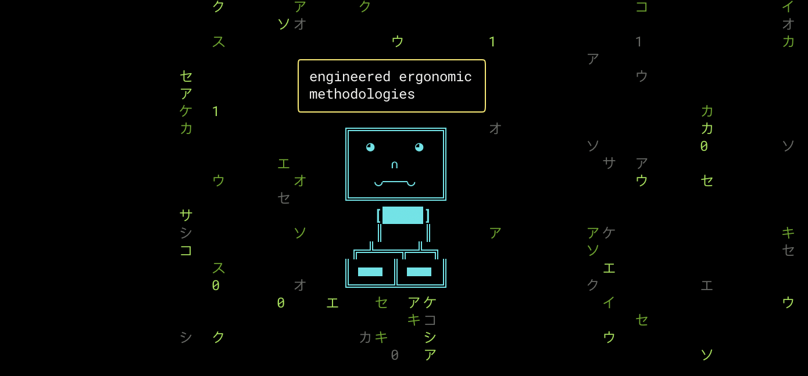

# Buzzphrase Buddy - AI Development Showcase 🤖

An interactive Matrix Robot demo with animated falling characters and tech buzzphrases that showcases AI integration in development workflows. The Buzzphrase Buddy demonstrates how AI tools can refactor complex animation logic into clean, maintainable code.



## What This Demo Does

🤖 **Buzzphrase Buddy Robot**: Animated ASCII robot with cyan glow effect in a Matrix-style terminal
💬 **Tech Buzzphrases**: Robot speaks randomized tech buzzwords every 7 seconds
🌧️ **Matrix Rain**: Beautiful green falling characters in the background
🎨 **Speech Bubbles**: Persistent speech bubbles with animated text wrapping
⚡ **Clean Code**: Demonstrates how AI tools transform complex animation logic into maintainable code

## The AI Development Story

Demonstrates how AI tools eliminate the traditional distinction between "warn" and "error" in linting - fixing complex animation logic and cyclomatic complexity becomes as trivial as fixing whitespace when AI handles the heavy lifting.

## Demo Flow

1. **Fun Buzzphrase Buddy Demo**: Run the robot demo to see animations and tech buzzphrases
2. **Show ESLint Patterns**: Demonstrate how AI tools handle various code quality issues
3. **AI Auto-Fix**: Use CLI AI tools to refactor animation logic into clean, maintainable code
4. **GitHub Integration**: Automated code review and PR creation

## Key Message

**Traditional Approach**: Warn vs Error distinction based on human effort
- Warn: "Hard to fix manually" (cyclomatic complexity, code smells)
- Error: "Easy to fix manually" (syntax, whitespace)

**AI-Enhanced Approach**: All issues become equally trivial to fix
- Set all linting rules to ERROR (including cyclomatic complexity)
- AI handles complexity refactoring as easily as formatting
- Eliminates artificial warn/error categorization
- Focus shifts to code quality, not fixing difficulty

## Project Structure

```
ai_review/
├── src/
│   ├── components/
│   │   └── matrixRain.js   # Matrix falling characters animation
│   ├── utils/
│   │   ├── terminalUtils.js # Terminal setup and cursor management
│   │   └── logger.js       # Winston logging for structured output
│   └── index.js            # Main application with robot ASCII art, speech bubbles, and animation loop
├── eslint.config.js        # Strict linting rules (complexity errors)
└── package.json            # AI-powered linting scripts + buzzphrase dependency
```

## Demo Script

### Phase 1: The Fun Demo (2 min)
- Run `npm run dev` to show the Buzzphrase Buddy demo in action
- Animated robot with cyan glow and Matrix rain background
- Tech buzzphrases in speech bubbles ("synergizing polymorphic hyperledgers")
- Press Q to quit, colorful animations, clean animation logic

### Phase 2: The AI Development Story (4 min)
- Run `npm test` - show how AI tools handle ESLint patterns
- Demonstrate `npm run fix:all:q` for AI-powered refactoring
- Watch AI transform code complexity, extract constants, improve maintainability
- Compare before/after: complex animation code → clean, modular functions

### Phase 3: GitHub Integration (2 min)
- AI creates PR with refactored animation system
- Automated code review identifies improvements
- Maintains visual effects while improving code quality

## Quick Start

```bash
npm install
npm run dev              # Launch the Buzzphrase Buddy Demo! 🤖
```

**Controls:**
- **Q**: Quit the demo

## AI Development Commands

```bash
npm test                 # Show ESLint patterns and code quality checks
npm run fix:all:q        # Use Amazon Q to fix ALL issues and create PR
npm run fix:all:c        # Use Claude to fix ALL issues and create PR
npm run fix:err:q        # Fix only errors (not warnings) with Amazon Q
npm run fix:err:c        # Fix only errors (not warnings) with Claude
```

## Implementation Steps

**Step 1: Foundation**
- JavaScript/Node.js project with complex components
- Intentionally write complex functions (authentication flow, data processing)
- Configure ESLint with ALL rules as ERRORS (including cyclomatic complexity)

**Step 2: AI Integration**
- Add package.json script for AI linting (lint:ai:q)
- Configure main lint script to auto-invoke AI fixing on errors
- GitHub Actions with Copilot review
- Test full pipeline locally

**Step 3: Polish & Practice**
- Refine demo timing (8 min total)
- Practice live coding portion
- Backup plans for demo failures

### Key Demo Features

1. **Complex Animation System** (perfect for AI refactoring):
   ```javascript
   // 20+ cyclomatic complexity, 6+ nesting depth
   function renderMatrixAndRobot(matrixColumns, robot, speechBubble, frameCount) {
     // Nested loops, complex timing logic, ANSI color codes
     // Multiple animation layers, speech bubble rendering
     // Buzzphrase generation, robot color transitions
   }
   ```

2. **Intentional Code Smells**:
   - `var` instead of `const/let` (prefer-const violations)
   - Magic numbers everywhere (no-magic-numbers)
   - Deep nesting (max-depth > 2)
   - Too many parameters (max-params > 2)
   - Console.log statements (no-console)
   - Callback functions instead of arrows (prefer-arrow-callback)

3. **Visual Impact**:
   - Colorful terminal output with ANSI codes
   - Matrix-style falling characters in green gradient
   - Animated robot with cyan glow effect
   - Speech bubbles with tech buzzphrases
   - Interactive controls for engagement

## Talk Takeaway

AI transforms development from "managing technical debt" to "writing intent, letting AI handle implementation details"


## Talk Steps

```
npm test
npm run fix:err:q # or npm run fix:err:c
```